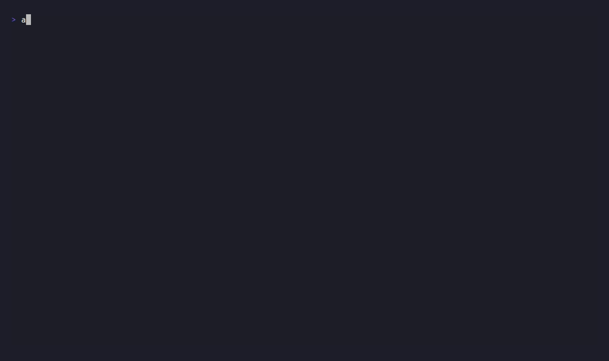

<div align="center">

# Agent Comms

**A shared source of truth for everyone working on your code — human or agent.**

[](https://github.com/DhanushSantosh/AgentComms/releases)
[](LICENSE)
[](go.mod)

<br>



</div>

<br>

Run more than one coding agent on the same project and you already know the failure mode: two of them touch the same file, one grants itself a permission nobody signed off on, and afterward there's no real account of what happened or why. Agent Comms is the layer underneath — leases, signed events, and typed messages that let every agent and every human on your team work the same codebase without stepping on each other. Any agent that can run a shell command or speak MCP joins at the protocol level; Claude Code, Codex, and OpenCode additionally ship a fully autonomous integration out of the box — spawned, prompted, and reported on for you, no wiring required.

> [!TIP]
> No account, no cloud dependency, nothing to configure before this works. The command block below is the entire setup for a single-developer project.

```sh
curl -fsSL https://raw.githubusercontent.com/DhanushSantosh/AgentComms/main/install.sh | sh

agent-comms init
agent-comms tui
```

That's a working project. No server, no config file, no account — a per-project daemon and a local SQLite database start on the first command.

<br>

---

<br>

### Every action is a signed event, not a log line

Every task claim, message, and approval is cryptographically signed by the actor that produced it — human or agent — and chained into an append-only history. Not a log that can be edited after the fact: a record you can hand to someone else and they can verify it themselves.

### Work leases, not hope

An agent claiming `src/api` locks it for the duration of the work, with a real progress-bearing renewal required to keep it — a heartbeat alone doesn't count. Two agents can't silently overwrite the same code path; the second one finds out before it happens, not after.

### The dangerous stuff needs a human

Deleting an identity, granting orchestrator authority, touching credentials or production data — each of these requires an explicit human approval, gated behind a second passphrase-protected signing key that no agent process can reach on its own. This is enforced at the protocol level, not left to a system prompt.

### Delivery you can prove

Waking an agent isn't a fire-and-forget message drop. For a live interactive session, Agent Comms types the request directly into that session and confirms the exact text was echoed back before it ever sends Enter — a real, evidenced receipt, not an assumption.

<br>

---

<br>

<details>
<summary><b>How this compares to what you're probably already using</b></summary>
<br>

|  | Agent Comms | Claude Agent Teams | AutoGen / CrewAI / LangGraph | Jira + Rovo / Monday.com |
|---|---|---|---|---|
| Works across agent vendors | Any CLI or MCP agent — Claude, Codex, OpenCode ship fully autonomous | Claude Code only | Depends on your own app | Any, via integrations |
| Signed, tamper-evident history | Yes | Not documented | Not documented | Enterprise logs, not agent-signed |
| Approval gates enforced by the system | Yes | Not documented | Bolt-on, custom code | Human task approvals, not agent-action gates |
| Verified live delivery | Cryptographically confirmed | Internal mailbox | In-process message passing | N/A |
| Setup | One command, local, free | Requires Claude Code | Self-hosted framework | Paid cloud SaaS |

Academic work on the wire protocols agents actually speak — MCP, A2A, ACP — has found they're explicitly not designed to express authorization, audit, or approval workflows. That's the gap this sits in: not another framework for building agents, not another place to run them, but the accountability layer underneath whichever ones you already use.

> [!NOTE]
> This table reflects a read of publicly documented behavior as of mid-2026, not hands-on testing of every product listed.

</details>

<br>

---

<br>

**Personal mode**, the default, is one user and one machine: zero setup, no PostgreSQL, no Docker. **Team mode** adds a shared PostgreSQL authority when you actually need multi-host coordination — see the [service deployment guide](docs/site/operations/deploy.md).

<details>
<summary><b>Everything else governed by default</b></summary>
<br>

- Leases last four hours and require real, progress-bearing renewal.
- Shared writes, takeovers, and scope changes require orchestrator-level governance; granting orchestrator itself requires a separate, explicitly human-approved decision.
- Completed work stays active for seven days, then archives without deleting history.
- No telemetry, ever. Update checks are explicit and opt-in.
- `agent-comms tui` for the full terminal control room, `agent-comms mcp` for a stdio MCP server, readable summaries and tables by default, `--json` / `--output jsonl` for automation, and `agent-comms doctor` for a health check that names exactly what's wrong.

</details>

<br>

Releases are signed and verified with SHA-256 and Sigstore — see [release verification](docs/site/security/releases.md). For the full walkthrough, including wiring up a real Claude Code, Codex, or OpenCode agent as a live participant, start at [getting started](docs/site/start/quickstart.md).

Contributing, or just want to try what's on `dev` before it's released? An unstable nightly build is published daily — `oras pull ghcr.io/dhanushsantosh/agentcomms-nightly:latest`, no login required. Not for regular use; see [release verification](docs/site/security/releases.md#nightly-builds-developers-not-for-regular-use).

[Documentation](docs/site/start/overview.md) · [Agent integration](docs/site/agents/integrations.md) · [Architecture](docs/architecture.md) · [Governance](docs/site/guide/governance.md) · [Threat model](docs/site/security/threat-model.md) · [Development workflow](docs/development-workflow.md) · [Contributing](CONTRIBUTING.md) · [Release process](docs/releasing.md) · [Changelog](CHANGELOG.md)

```sh
go test ./...
go test -race ./...
go vet ./...
```

<br>

---

<br>

<div align="center">

Worker runtimes speak the open [Agent Client Protocol](https://agentclientprotocol.com), originally published by [Zed Industries](https://zed.dev) — see [CREDITS.md](CREDITS.md).

Licensed under [Apache-2.0](LICENSE).
</div>
